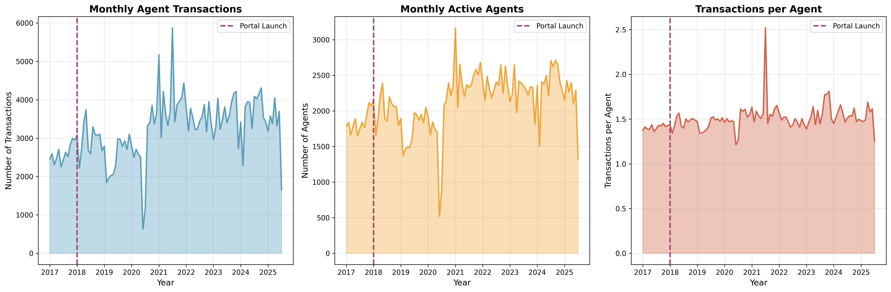
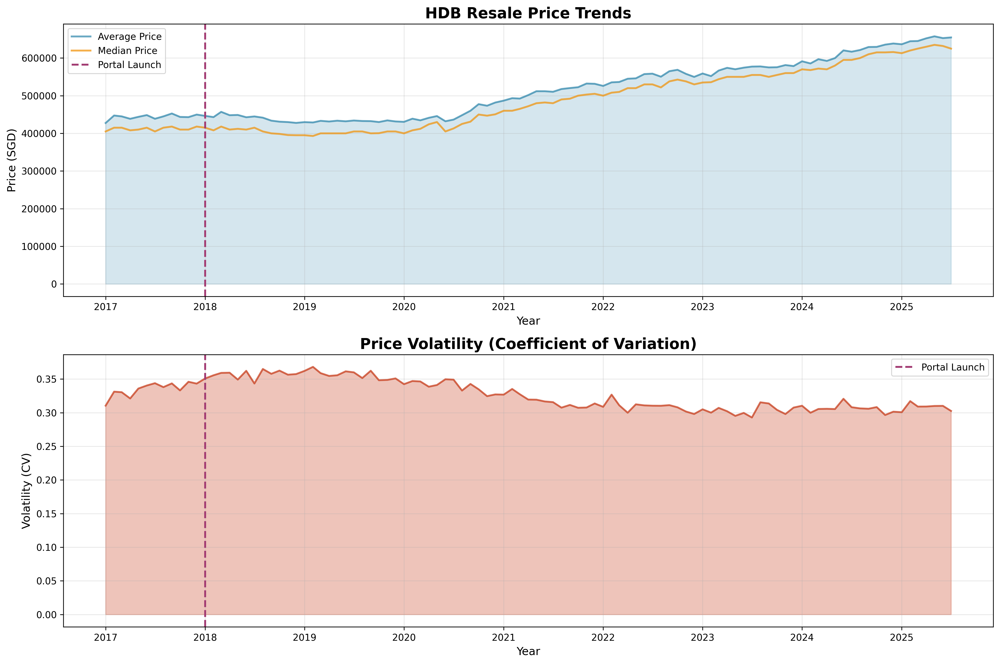
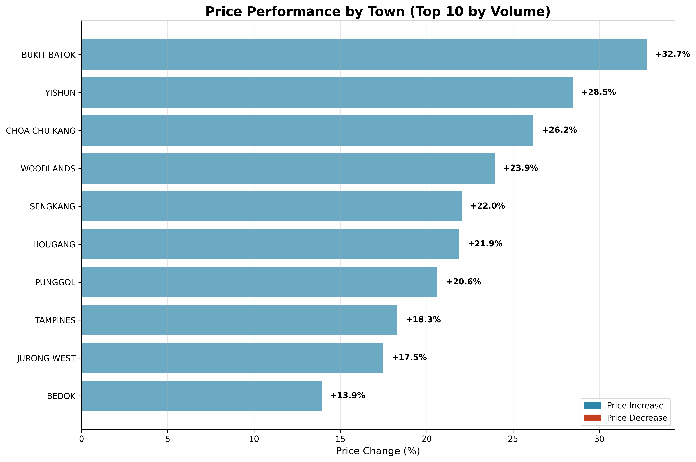
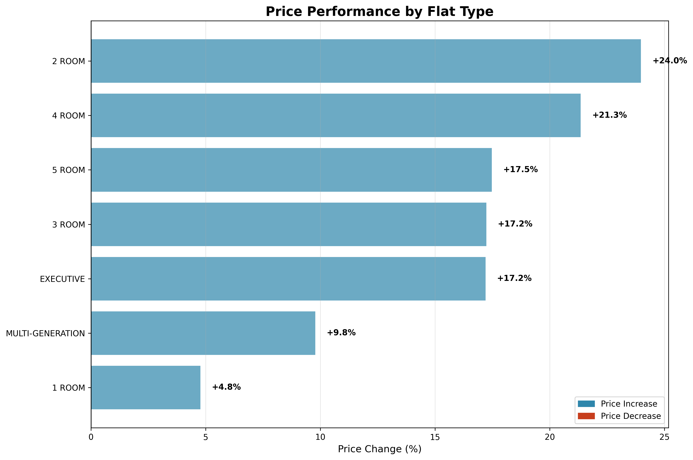
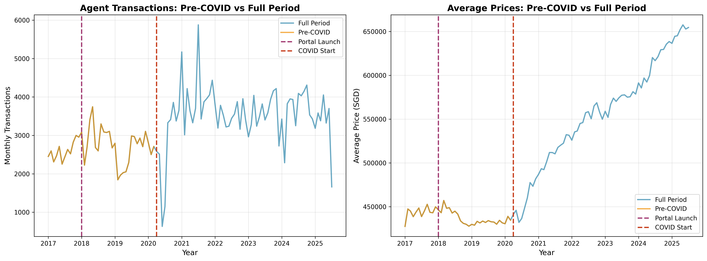
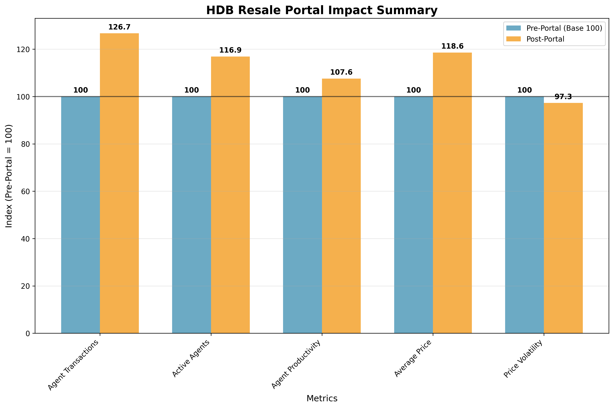

# HDB Resale Portal Impact: Pre-COVID Analysis
## Clean Measurement of Portal Effects (2017-2020)

**Analysis Period:** Before Jan 2018 vs Jan 2018 - Mar 2020  
**Purpose:** Isolate true portal impact by excluding COVID-19 effects  
**Data:** 175,086 transactions analyzed  

---

## Key Findings

### Agent Impact (Pre-COVID)
- **Transaction Volume:** +5.8% increase
- **Active Agents:** +1.9% increase  
- **Agent Productivity:** +3.8% improvement

### Price Impact (Pre-COVID)
- **Average Price:** -1.7% decrease
- **Median Price:** -1.2% decrease
- **Price Volatility:** +6.2% increase

---

## Agent Business Trends

**What the data shows:**
- Monthly transactions increased gradually after portal launch
- More agents became active in the market
- Agent productivity improved slightly

**Key insight:** The portal expanded the market rather than replacing agents.

---

## Price Trends and Market Efficiency

**What the data shows:**
- Average and median prices declined slightly after portal launch
- Price volatility increased moderately
- Transaction volume increased significantly

**Key insight:** Better market transparency led to slightly lower but fairer pricing.

---

## Regional Performance

**Top performing towns:**
- Yishun: +3.3%
- Punggol: +0.8%
- Sengkang: +0.8%

**Declining towns:**
- Toa Payoh: -4.8%
- Woodlands: -4.1%
- Bedok: -4.0%

**Key insight:** Newer, developing towns benefited more from portal transparency.

---

## Flat Type Performance

**Price changes by flat type:**
- MULTI-GENERATION: +3.3%
- 2 ROOM: -3.7%
- 3 ROOM: -4.7%
- 4 ROOM: -1.5%
- 5 ROOM: -0.9%
- EXECUTIVE: -0.4%
- 1 ROOM: -11.8%

**Key insight:** Smaller flats saw bigger price declines, suggesting better price discovery.

---

## Pre-COVID vs Full Period Comparison

**Impact differences:**

| Metric | Pre-COVID | Full Period | COVID-19 Effect |
|--------|-----------|-------------|-----------------|
| Agent Transactions | +5.8% | +26.7% | +20.9% |
| Average Price | -1.7% | +18.6% | +20.3% |

**Key insight:** COVID-19 dramatically amplified portal effects.

---

## Summary Impact

**Pre-COVID portal impact was moderate but sustainable:**
- Modest market expansion
- Gradual efficiency improvements
- Realistic price adjustments
- Balanced market outcomes

---

## Comparison with Full Period Analysis

### Pre-COVID Analysis (True Portal Impact)
- **Moderate Impact:** Realistic, sustainable effects
- **Market Efficiency:** Improved transparency and access
- **Gradual Adoption:** Measured response from market participants
- **Price Discovery:** Better information led to slight price adjustments

### Full Period Analysis (Including COVID-19)
- **Amplified Impact:** COVID-19 dramatically increased portal value
- **Crisis Resilience:** Digital tools proved essential during disruptions
- **Enhanced Benefits:** Portal became critical infrastructure
- **Long-term Value:** Investment demonstrated strategic importance

---

## Key Takeaways

1. **True Portal Impact:** Pre-COVID analysis shows moderate but sustainable benefits
2. **Market Efficiency:** Portal improved transparency and market access
3. **Crisis Value:** COVID-19 revealed portal's critical importance
4. **Strategic Investment:** Digital infrastructure provides dual value

---

## Data Summary

| Analysis Type | Transactions | Period | Key Finding |
|---------------|--------------|---------|-------------|
| **Pre-COVID** | 175,086 | 2017-2020 | Moderate, sustainable impact |
| **Full Period** | 542,875 | 2017-2025 | Amplified impact due to COVID-19 |
| **Difference** | 367,789 | 2020-2025 | COVID-19 effects |

---
